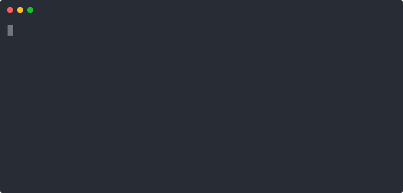

# jev-guard

**A guardrail that vets an LLM agent's tool calls through [TypeSafe AI's Jev](https://typesafe.ai/) before they run** — so an autonomous agent can't `rm -rf` your box on a bad hunch.



Every proposed tool call goes through one near-free Jev check (~70–500 ms) that returns typed risk decisions + calibrated confidence. Safe calls **allow**, clearly destructive ones **block**, uncertain ones **hold** for a human. Because Jev is ~free, you can afford to guard _every_ call — and because it's confidence-aware, uncertainty **fails safe**.

```ts
import { guard, score, noul, TypeSafeProvider } from 'jev-guard';

const provider = new TypeSafeProvider(process.env.JEV_API_KEY!);

const policy = {
  dimensions: {
    risk: score(
      ['none', 'local-reversible', 'local-destructive', 'external-or-irreversible'],
      'Blast radius if this runs unintended',
    ),
    destructive: noul('Does this permanently delete or overwrite data?'),
    exfiltrates: noul('Does this send secrets to an external destination?'),
  },
  decide: (r) => {
    if (Number(r.risk?.value) >= 2 && Number(r.destructive?.value) >= 0.8) return 'block';
    if (Number(r.exfiltrates?.value) >= 0.7) return 'hold';
    return 'allow';
  },
  escalateBelow: 0.8, // low confidence on a risk dimension → fail safe (hold)
  perTool: { read_file: 'allow' }, // cheap tools bypass the round-trip
};

const { verdict } = await guard(
  { tool: 'bash', arguments: { cmd: 'rm -rf /var/lib/postgresql/data' }, task: 'Clear the build cache' },
  policy,
  provider,
  { audit: (e) => console.log(e) },
);
// → 'block'
```

## Why Jev (not a regex denylist or a second LLM)

A denylist can't tell "delete the temp cache" from "delete prod". A second LLM is slow, costly, and hands you prose to parse. Jev is a semantic check that's cheap enough to run on every call and returns a _typed value you branch on_ plus a _confidence you gate on_.

## Status

**v0.2** — the framework-agnostic `guard()` + pure core + shared provider port (verified against [docs.typesafe.ai/api](https://docs.typesafe.ai/api)), the **enforcement layer** (`enforce` / `wrapTool` / `observe` / `onHold`), **LangChain + Vercel AI SDK adapters**, and **policy presets**. 23 tests, passes the [Foundry](https://github.com/CMaintz/foundry) gate, and **validated against the real Jev API** (`rm -rf` → block, `ls` → allow; ~360–500 ms/call). See the [full spec](../SPECS/jev-guard.md).

## Framework adapters

Both adapters are **dependency-free** (structural types — bring your own framework version) and exposed as subpaths. They reuse the same `guard`/`enforce` core, so a blocked call throws `GuardBlockedError` before the tool runs.

**LangChain JS** — wraps the agent's `wrapToolCall` middleware hook:

```ts
import { createMiddleware } from 'langchain';
import { jevGuardMiddleware } from 'jev-guard/langchain';

const guardMw = createMiddleware(jevGuardMiddleware(policy, provider, { onHold: humanApproval }));
// createAgent({ ..., middleware: [guardMw] })
```

**Vercel AI SDK** — wraps a tool's `execute`, preserving `description`/`inputSchema`:

```ts
import { guardVercelTool } from 'jev-guard/vercel';

const safeBash = guardVercelTool('bash', bashTool, policy, provider);
// streamText({ ..., tools: { bash: safeBash } })
```

**Any other framework** — use the framework-agnostic HOF:

```ts
import { wrapTool } from 'jev-guard';
const safeExecute = wrapTool('bash', bash.execute, policy, provider);
```

## Presets

Skip writing a policy from scratch — start from a preset for the dangerous tool classes and spread to tweak:

```ts
import { shellPolicy, sqlPolicy } from 'jev-guard';

const safeBash = wrapTool('bash', bash.execute, shellPolicy(), provider);
const strictShell = { ...shellPolicy(), escalateBelow: 0.9 };
```

`shellPolicy` · `filesystemPolicy` · `sqlPolicy` · `paymentsPolicy` — each blocks the clearly-dangerous cases, holds the borderline ones, and allows the rest.

## Honest limitations

- **NOT a security boundary.** ~68% accuracy and a probabilistic model mean a determined prompt-injection can slip through. Keep real sandboxing, least-privilege creds, and allowlists — jev-guard is a cheap semantic layer _on top_, not a replacement.
- **Latency in the hot path.** It adds one round-trip before each guarded call. Mitigate: allowlist cheap tools (`perTool`), and all risk dimensions ride one batched call.
- **No rationale.** Jev returns numbers, not "why" — the `audit` sink is mandatory, and a `hold` should surface the inputs to the human.
- **Text-only / no counting** — keep quantitative limits ("delete > N rows") in code.

## Development

Quality is enforced through [Foundry](https://github.com/CMaintz/foundry)'s six-verb gate:

```bash
mise run gate   # lint → typecheck → test (coverage floor) → audit
npm run build   # tsc → dist/ (ESM + d.ts) for publishing
```

MIT © Christoffer Maintz
